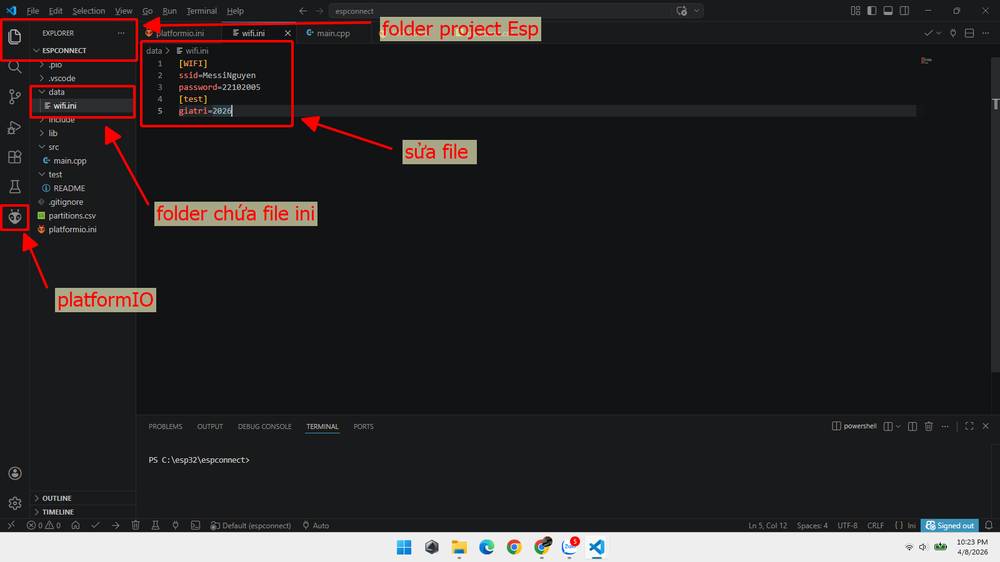
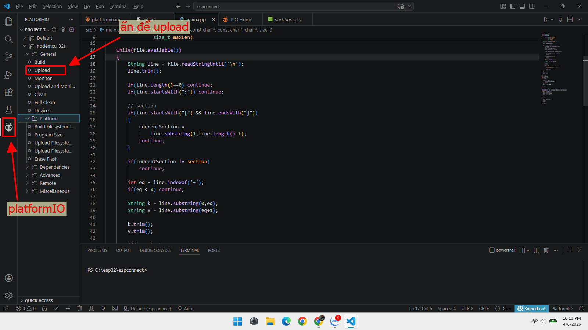

# D23_LE_TUAN_HUNG
***báo cáo công việc ngày 4/4/26***
# A. Công việc đã làm
1. Cấu hình partiton
2. Cách lấy dữ liệu trong file
3. Các cách sửa file
4. Các loại file system
5. Tổng hợp các loại MQTT broker

# B. Công việc chi tiết

## 1. Cấu hình partition
Cấu hình partition của em là mặc dịnh với cấu hình :
```
# Name, Type, SubType, Offset, Size
nvs,      data, nvs,     0x9000,  0x5000
otadata,  data, ota,     0xE000,  0x2000
app0,     app,  ota_0,   0x10000, 0x140000
app1,     app,  ota_1,   ,        0x140000
spiffs,   data, spiffs,  ,        0x170000
```
## 2. Cách lấy dữ liệu trong file
*Dữ liệu trong file ini :
```
[WIFI]
ssid=MessiNguyen
password=22102005
[test]
giatri=2026
```
- Có 2 chủ đề là ```wifi``` và ```test```
- Trong ```wifi``` có 2 cặp key value
- Trong ```test``` có 1 key value là giá trị số

*Em không sử dụng thư viện có săn để code lấy dữ liệu mà em tự viết 1 hàm  trong [main](src/main.cpp) để lấy dữ liệu :
```c
bool getIniValue(const char* filename,
                 const char* section,
                 const char* key,
                 char* output,
                 size_t maxLen)
```

- Hàm này có 5 parameter với : 
     - ```filename``` là tên của file .ini mà mình muốn lấy dữ liệu
     - ```section``` là chủ đề của value mà mình muốn lấy
     - ```key``` là key của value trong file ini
     - ```outut``` là biến ta gọi bên ngoài đề lưu giá trị trong file ini vào(thường là biến char)
     - ```maxLen``` là số lượng kí tự của biến ta muốn lưu giá trị vào. Nếu không có biếm này thì dữ liệu ra dễ bị thành giá trị rác

*Các bước hoạt động của hàm :
- Bước 1 — mở file
~~~c
File file = SPIFFS.open(filename,"r");
~~~

Nếu fail:

```c 
return false;
```
- Bước 2 — nhớ section hiện tại

```c
String currentSection="";
```


- Bước 3 — đọc từng dòng

```c
while(file.available())
```

ESP32 đọc file line by line.

- Bước 4 — bỏ dòng rác
```c
line.trim();
if(line.length()==0) continue;
if(line.startsWith(";")) continue;
```

Bỏ dòng trống, comment

- Bước 5 — gặp section mới
```c
if(line.startsWith("[") && line.endsWith("]"))
```

Ví dụ:

```c
[WIFI]
```

→ cập nhật:

```c
currentSection="WIFI";
```

- Bước 6 — chỉ xử lý đúng section
```c
if(currentSection != section)
    continue;
```

Nếu đang ở [MQTT] mà bạn cần [WIFI] → bỏ qua.

- Bước 7 — tách key=value
```c
ssid=MyWifi
int eq=line.indexOf('=');
```

Tìm dấu "=:" --> Sau đó tách k = "ssid", v = "MyWifi"

- Bước 8 — nếu đúng key
```c
if(k==key)
```

Bước 9 — copy kết quả ra biến của bạn
```c
strncpy(output, v.c_str(), maxLen-1);
output[maxLen-1]='\0';
```

Bước 10 — thành công
```c
return true;
```

Nếu đọc hết file mà không thấy
```c
return false;
```
*Cách config :
- Em sẽ khai báo 1 biến ```char``` để lưu giá trị lấy từ file 
```c
char ssid[32];
char password[64];
char giatristr[10];
```
- Sau khi gọi hàm thì các biến ```char``` đấy sẽ lưu giá trị lấy được :
```c
getIniValue("/wifi.ini","WIFI","ssid",ssid,sizeof(ssid));
getIniValue("/wifi.ini","WIFI","password",password,sizeof(password));
getIniValue("/wifi.ini","test","giatri",giatristr,sizeof(giatristr));
```
> Chú ý : Các value trong file ini đều là kí tự chứ không phải ở dạng số.
- Nên sau đó ta khai báo thêm 1 biến với kiểu dữ liệu mà mình muốn ví dụ như ```int, bool, string, long long``` và dùng các hàm chuyển kiểu dữ liệu như ```atoi(), atoll(),...``` để chuyển sang kiểu dữ liệu ta muốn :
```c
int giatri = atoi(giatristr);
```


## 3. Cách sửa file
- Theo em  biết thì có 3 cách sửa file ini : 
   - Dùng web Espconnect để upload file đã sửa
   - Dùng Vscode để upload lại SPIFFS
   - Lập trình cho Esp để Esp tự sửa


### a. Dùng web Espconnect


Vào phần spiffs tool của espconnect sau khi kết nổi với Esp để upload lại file ini trong thư muc

--> Thời gian khá lâu khoảng 20s tình thời gian kết nối với Esp và đọc dữ liệu trong flash


### b. Dùng Vscode(hoặc dùng arduinoIDE)


Tạo file ini trong folder của project Esp, sau đó ấn vào platformIO



Sau khi ấn vào platformIO thì ấn vào upload để upload file lên flash của Esp

--> Thời gian nhanh hơn cách 1, khoảng vài giây

### c. Code cho Esp tự up file
*Ghi file trực tiếp với : [code](<src/main - Copy.cpp>)

khi chạy terminal hiện :
```
SPIFFS READY
WiFi saved to flash
---- FILE CONTENT ----
[WIFI]
ssid=MyWifi
password=12345678
```

--> Thời gian lâu hau chậm phải phụ thuộc vào việc sửa nhiều hay ít dữ liệu

*Upload file qua web với : [code](<src/main - Copy (2).cpp>)

Code này sẽ tạo ra 1 địa chỉ IP web, khi kết nối wifi thành công với Esp ta có thể vào web đấy để up file mà ta cần. Dữ liệu sẽ được sửa và đưa vào Esp bằng đường wifi

--> Thời gian nhanh, khoảng mười mấy giây

*Sửa và cấu hình bằng serial command với bản chạy thử : [code](<src/main - Copy (3).cpp>)

Ta gửi lệnh trong terminal cho Esp để thay đổi key value trong file ví dụ :
```
SET WIFI Xuong 68686868
```

--> Nhanh nhất trong các cách


## 4. Các loại file system

1. SPIFFS (SPI Flash File System) là : File system chuyên thiết kế cho SPI NOR Flash nhỏ, không có sector cố định như ổ cứng.

2. LittleFS là : File system thế hệ mới cho NOR Flash, tập trung vào độ bền và an toàn dữ liệu.

3. FFat (FatFs) là : File system mô phỏng ổ đĩa FAT giống USB / SD card trên flash ESP32.

*So sánh :


| Tiêu chí | SPIFFS | LittleFS | FATFS |
|---|---|---|---|
| Loại filesystem | Flash file system | Flash file system thế hệ mới | File system chuẩn FAT |
| Mục đích chính | Lưu file nhỏ | Thay thế SPIFFS | Lưu file lớn / SD card |
| Độ ổn định | Trung bình | Rất cao | Cao |
| Chống mất điện | Trung bình | Tốt | Tốt |
| Tốc độ đọc | Khá | Nhanh | Nhanh |
| Tốc độ ghi | Trung bình | Tốt | Tốt |
| Wear leveling (chống mòn flash) | Có | Tốt hơn SPIFFS | Có |
| Thư mục (folder) | Không thật | Có | Có |
| Dung lượng file lớn | Không tốt | Khá | Rất tốt |
| Phù hợp ESP32 Flash | Tốt | Tốt nhất | Không tối ưu |
| Phù hợp SD Card | Không | Không | Rất tốt |
| Tình trạng hiện tại | Deprecated | Khuyên dùng | Dùng cho SD/USB |
| Ứng dụng điển hình | Web file cũ | Web server, config, OTA | Audio, log, dữ liệu lớn |

> Kết luận 

- **LittleFS** : lựa chọn tốt nhất cho ESP32 flash.
- **SPIFFS** : cũ, chỉ dùng cho project legacy.
- **FATFS** : dùng khi cần SD Card hoặc file lớn.


## 5. Tổng hợp các loại MQTT broker
Có rất nhiều MQTT broker ví dụ các broker phổ biến như : HiveMQ, EMQX, Eclipse Mosquitto, CloudMQTT,...

- Trong đấy em đã test qua sử dụng HiveMQ và chạy được trong bài báo cáo tuần [14-03-26](../14-03-26)

- Cái này ta được dùng miễn phí với những dự án nhỏ. Còn với dự án lớn thì phải mất phí

- Cái này đăng kí bằng Gmail tại web


# C. Khó khăn đang gặp
- Chưa test được 2 cách sửa file qua websocket và sửa qua sertial command 

- Mới chỉ test được broker HiveMQ

# D. Công việc tiếp theo


# F. Linh kiện đang giữ
|Tên|Số lượng|
|---|---|
|Không |Không |
| | |
| | |
| | |