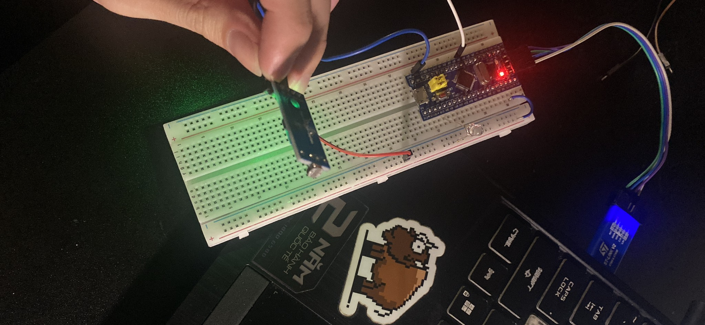
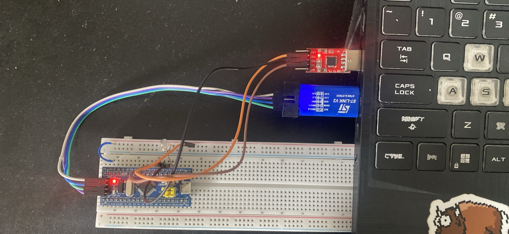
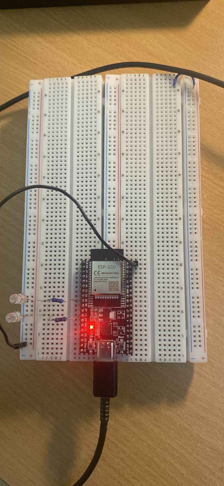

# D23_LE_TUAN_HUNG
***báo cáo công việc ngày 7/3/26***
# A. Công việc đã làm
1. Tìm hiểu về STM32
2. Tìm hiểu về giao thức MQTT
3. Set up một project đơn giản ESP32 kết hợp MQTT

# B. Công việc chi tiết

## 1.Tìm hiểu về STM32

### 1.1. Cách tìm hiểu và học về ngoại vi
* Em học về cái giao thức có trong STM32
* Trong quá trình học về giao thức, cảm biến nào sử dụng giao thức đó thì em sẽ lấy ra chạy thực tế
* Em tìm hiểu bằng cách :
  * Đọc [reference manual STM32](<tai_lieu/RM Stm32f103.pdf>)
  * Xem [video](https://youtu.be/v0jaNTe81fo?si=XqXX2Cf-EGy8csEH) để học cách code
  * Kết hợp hỏi AI

### 1.2 Những thứ đã học 
- Đã học về STM32F1
- Đã học và viết thư viện của các giao thức :  
   - Giao thức [ADC](src/ADC)
   - [GPIO](src/GPIO)
   - Giao thức [I2C](src/I2C)
   - Giao thức [TIMER](src/TIMER)
   - [USART](src/USART)

- vài project nhỏ khi học STM32F1:
   - Đọc cảm biến ánh sáng bằng ADC kết hợp TIMER điều khiển cường độ led để mô phỏng đơn giản đèn ngủ trong nhà
   

   - Dùng module PC2120 giao tiếp USART để điều khiển bật tắt led qua máy tính bằng app hercules terminal
   

> Em có hiểu sơ sơ qua cách hoạt động của ngoại vi


## 2. Tìm hiểu về giao thức MQTT
### 2.1. MQTT là gì 
MQTT (Message Queuing Telemetry Transport) là giao thức truyền dữ liệu theo mô hình publish/subscribe dùng để trao đổi dữ liệu giữa các thiết bị qua mạng TCP/IP
### 2.2. Cấu tạo hệ thống của MQTT
#### 2.2.1. Broker là trung tâm của hệ thống MQTT

Nhiệm vụ của broker: 
* nhận dữ liệu từ publisher
* kiểm tra topic
* gửi dữ liệu đến subscriber phù hợp
* quản lý kết nối client
* quản lý QoS

Một số broker phổ biến:
* Mosquitto MQTT Broker
* HiveMQ
* EMQX
#### 2.2.2. Client là thiết bị kết nối với broker
Client có thể là:
* publisher: Thiết bị gửi dữ liệu
* subscriber: Thiết bị nhận dữ liệu
* hoặc cả hai

Ví dụ client:
* ESP32
* cảm biến
* ứng dụng điện thoại
* máy tính

#### 2.2.3. Topic là đường dẫn logic để phân loại dữ liệu
+ Broker dựa vào topic để biết gửi dữ liệu cho ai

Ví dụ:
```
home/temperature
home/light1
home/light2
factory/motor/status
```
### 2.3. Cách hoạt động của MQTT
*Quy trình hoạt động:

* Bước 1:
    Client kết nối broker
~~~
Client ---- CONNECT ----> Broker
~~~
* Bước 2:
    Subscriber đăng ký topic
~~~
SUBSCRIBE home/temp
~~~
* Bước 3:
    Publisher gửi dữ liệu
~~~
PUBLISH home/temp = 30
~~~
+ Bước 4:
    Broker gửi dữ liệu cho subscriber
~~~
Broker ----> Subscriber
~~~
<p align="center">
  
  <br>
  <em>mô hình hoạt động của MQTT</em>
</p>

### 2.4. Cấu trúc gói tin của MQTT
Một số MQTT packet có 3 thành phàn trính
~~~
MQTT Packet
│
├── Fixed Header
│     ├── Packet Type
│     ├── Flags
│     └── Remaining Length
│
├── Variable Header
│     ├── Topic
│     ├── Packet ID
│     └── Protocol info
│
└── Payload
      └── Data
~~~
#### a. Fixed Header
* Là phần bắt buộc trong mọi gói MQTT.

* Chứa:

     * Packet Type: xác định loại gói tin (CONNECT, PUBLISH, SUBSCRIBE,…).

     * Flags: các bit điều khiển (QoS, DUP, RETAIN…).

     * Remaining Length: độ dài phần dữ liệu còn lại của gói tin.

* Mục đích: Giúp thiết bị nhận biết loại gói tin và kích thước dữ liệu cần đọc.

#### b. Variable Header 
+ Chứa thông tin phụ thuộc vào loại packet.

+ Mục đích: Cung cấp thông tin chi tiết để broker xử lý gói tin.
#### c. Payload
+ Là phần dữ liệu thực sự được truyền.

+ Ví dụ:

     + dữ liệu cảm biến

     + trạng thái thiết bị

+ Mục đích: Chứa nội dung dữ liệu mà thiết bị muốn gửi hoặc nhận.

<p align="center">
  
  <br>
  <em>cấu trúc gói tin</em>
</p>


## 3. Set up 1 project đơn giản ESP32 kết hợp MQTT
### 3.1. Mạch mô phỏng đơn giản


*Sử dụng 2 chân 14 và chân 25 để điều khiên led* 

### 3.2. Broker và code
* Em sử dụng [HiveMQ](https://www.hivemq.com/products/mqtt-cloud-broker/) làm broker
* Dùng Visual code để lập trình cho ESP32

### 3.3. Quá trình set up
* Vào HiveMQ để tạo server(url,port,usename,pass,...)
* Sau đó code cho ESP32 : [Code](src/project_esp32_mqtt)
* Các bước hoạt động chính :
   * Kết nối wifi :
   ~~~c
   //const char* ssid = "TuanDung";
   //const char* password = "0913583737";
   WiFi.begin(ssid, password);
   ~~~
   * Mở server broker :
   ~~~c
   //const char* mqtt_server = "449b784be10a4cc9b33005afc8231712.s1 eu.hivemq.cloud";
   //const int mqtt_port = 8883;
   client.setServer(mqtt_server, mqtt_port);
   ~~~
   * Kết nối Broker của HiveMQ :
   ~~~c
   //const char* mqtt_user = "ESP32_MQTT";
   //const char* mqtt_pass = "Abc@1234";
   client.connect("ESP32Client", mqtt_user, mqtt_pass)
   ~~~
   * Tạo MQTT client :
   ~~~c
   WiFiClientSecure espClient;
   PubSubClient client(espClient);
   ~~~
   * Đăng kí topic :
   ~~~c
   client.subscribe("esp32/led1");
   client.subscribe("esp32/led2");
   ~~~
   * Đăng kí hàm callback :
   ~~~c
   client.setCallback(callback);
   ~~~
   --> Khi có message từ broker thì gọi làm callback để điều khiển led
   * Xử lí message MQTT :
   ~~~c
   client.loop();
   ~~~
   --> Kiểm tra message mới
  
* Luồng dữ liệu hệ thông :
~~~
Web Client
    |
    | publish
    v
esp32/led1
    |
    v
HiveMQ
    |
    v
ESP32
    |
    | bật LED
    |
    | publish
    v
esp32/led1/status
~~~

## 3.4. Kết quả thức nghiệm 
Điều khiển bật 2 led :
<p align="center">
  
  
</p>

Giá trị hiển thị lên web client :


# C. Khó khăn đang gặp
Không có
# D. Công việc tiếp theo

# F. Linh kiện đang giữ
|Tên|Số lượng|
|---|---|
|Không |Không |
| | |
| | |
| | |