# D23_LE_TUAN_HUNG
***báo cáo công việc ngày 11/4/26***
# A. Công việc đã làm
1. Các cách up file
2. Thư viện đọc file ini
3. Kết nối 3 mqtt
4. cấu hình dữ liệu trong file ini
5. thêm 1 vùng littlefs 64kb
6. gửi dữ liệu đồng thời trên 3 mqtt server 
7. cấu hình nhiều wifi, 


# B. Công việc chi tiết

## 1. Cấc cách up file

*Các cách em hay dùng*

*Dùng web Espconnect


Vào phần spiffs tool của espconnect sau khi kết nổi với Esp để upload lại file ini trong thư muc

--> Thời gian khá lâu khoảng 19s tình thời gian kết nối với Esp và đọc dữ liệu trong flash


*Dùng Vscode(hoặc dùng arduinoIDE)


Tạo file ini trong folder của project Esp, sau đó ấn vào platformIO


Sau khi ấn vào platformIO thì ấn vào upload để upload file lên flash của Esp

--> Thời gian nhanh hơn cách 1, khoảng 9 giây

## 2. Thư viện đọc file ini

Theo em tìm hiểu trên mạng thì có các thư viện như : [IniFile](<src/thư viện/IniFile>), inih, Simplelini là hỗ trợ đọc file ini 

Tuy nhiên em chỉ tìm thấy thư viện ``` IniFile ``` trên platform

Bảng so sánh :

| Thư viện    | Nên dùng | Độ phổ biến ESP32 | Sử dụng trên platform IO |
| ----------- | -------- | ----------------- | ------------|
| IniFile     | Tốt      | Cao               | Có          |
| inih        | Rất tốt  | Cao               | Không       |
| SimpleIni   | Không    | Thấp              | Không       |

- Em chọn thư viện ```IniFile``` vì trong này có 1 hàm rất tiện. Hàm này có thể chọn file, chọn section và chọn value của key mà mình muốn lấy :
```c
bool getIniValue(const char* filename,
                 const char* section,
                 const char* key,
                 char* output,
                 size_t maxLen);
```


## 3. Kết nối 3 MQTT broker
Em dùng 3 MQTT broker là :[Hivemq cloud](https://www.hivemq.com/products/mqtt-cloud-broker/), [EMQX cloud](https://www.emqx.com/en/cloud), [Flespi](https://flespi.com/mqtt-broker)

### a. Các bước đăng kí HiveMQ cloud


*vào trang web đăng kí*


*chọn gmail hoặc những tài khoản khác*
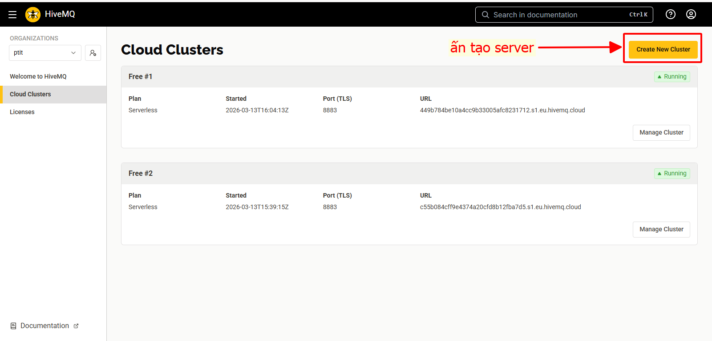
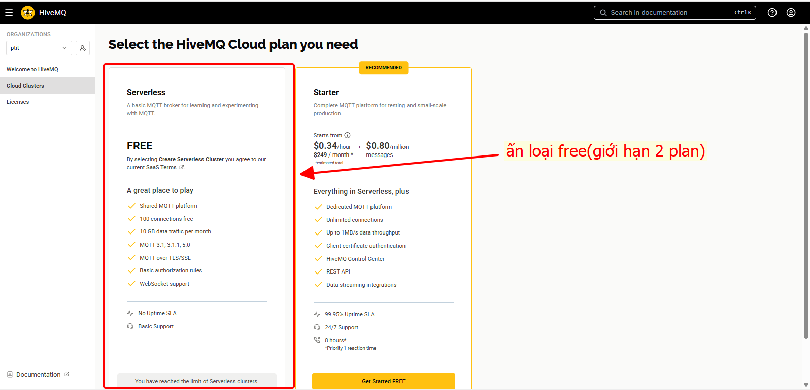
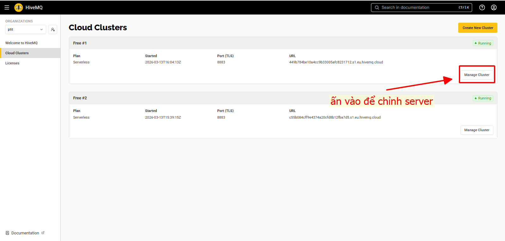
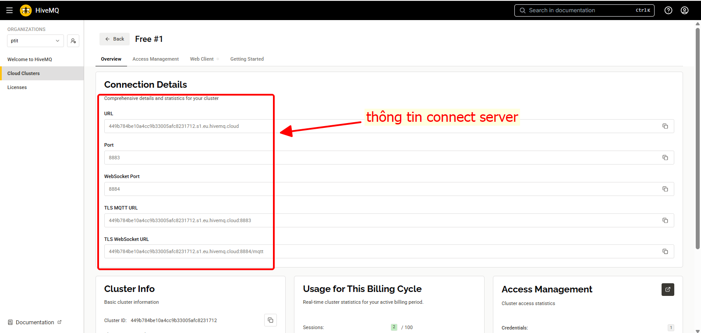
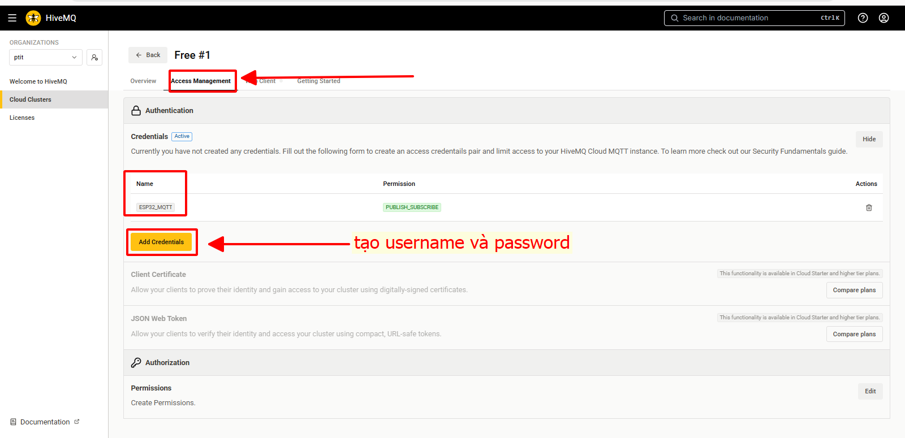
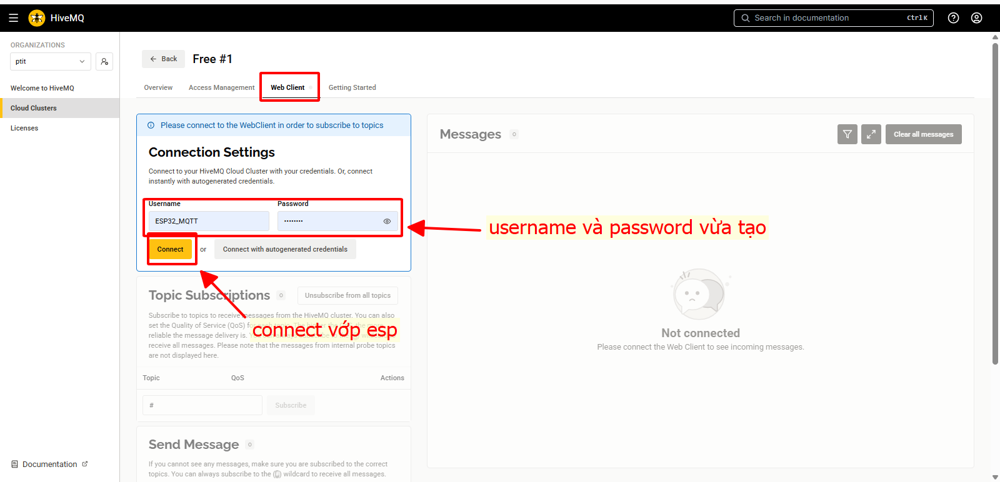


### b. Các bước đăng kí EMQX


**vào trang web để đằng kí
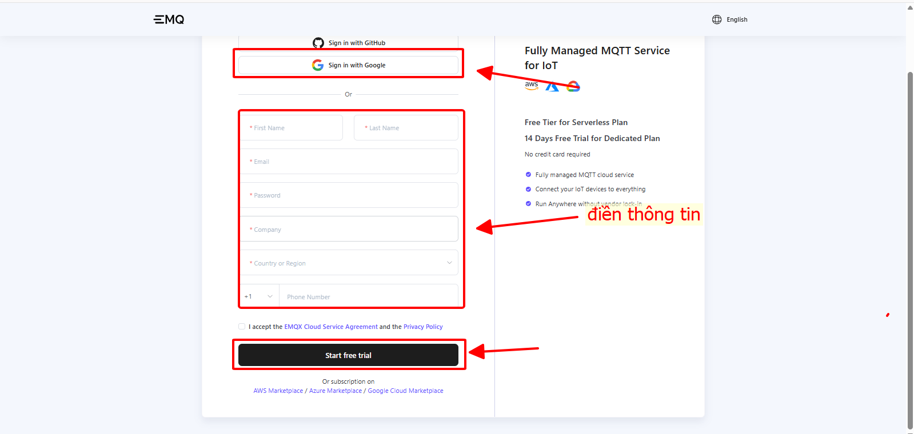
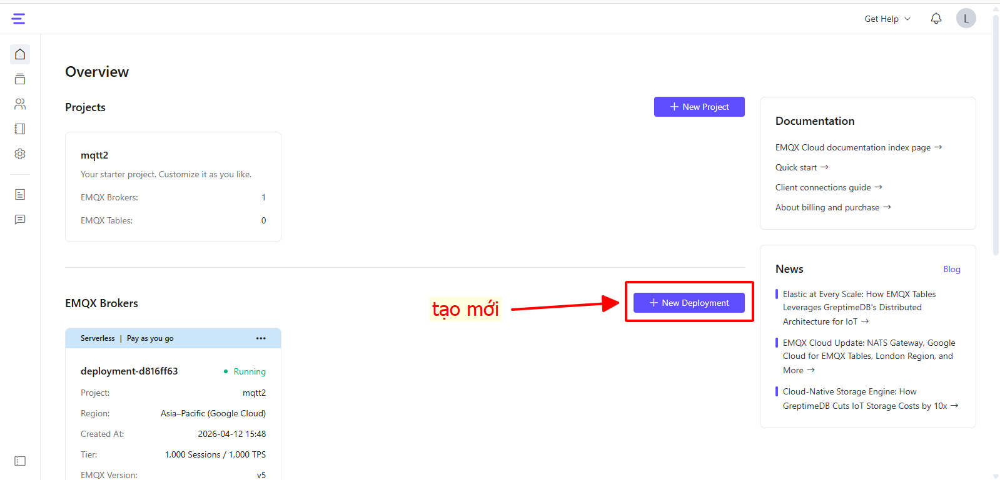
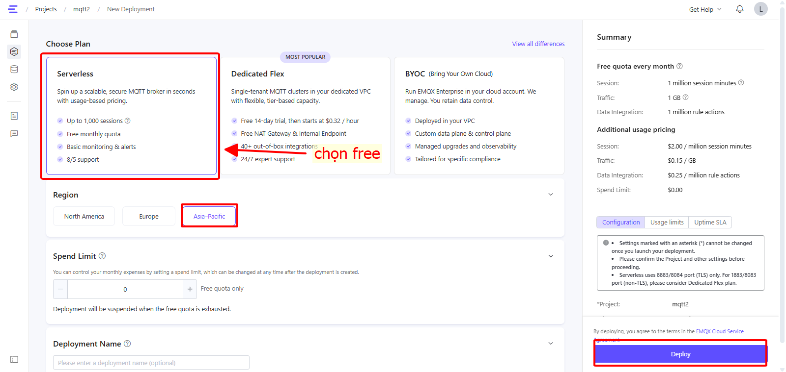
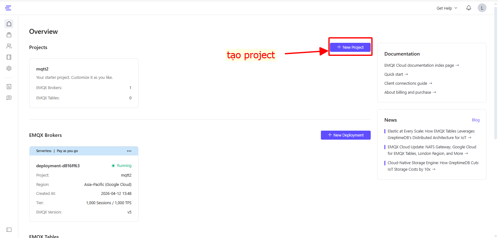
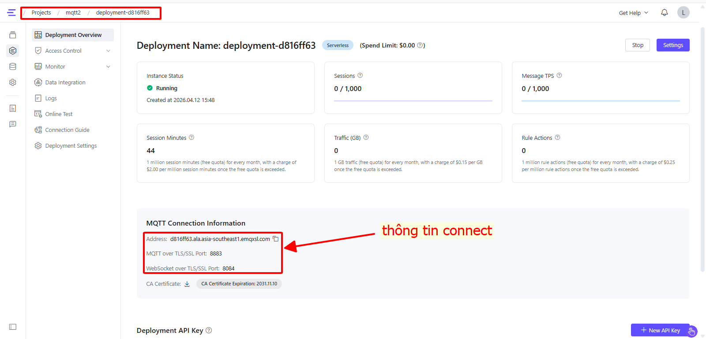
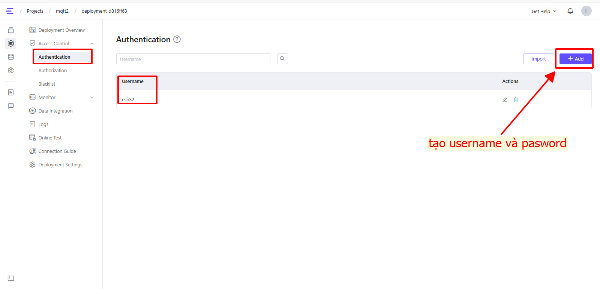
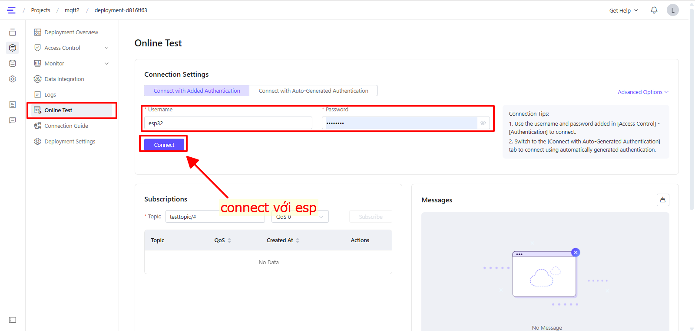


### c. Các bước đằng kí Flespi
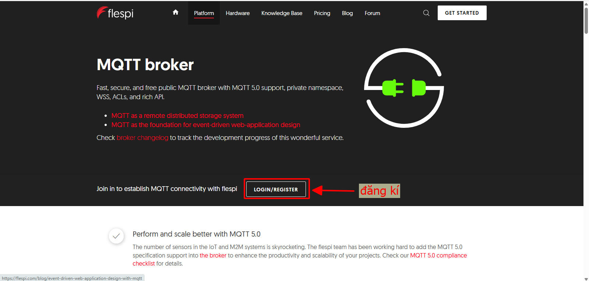
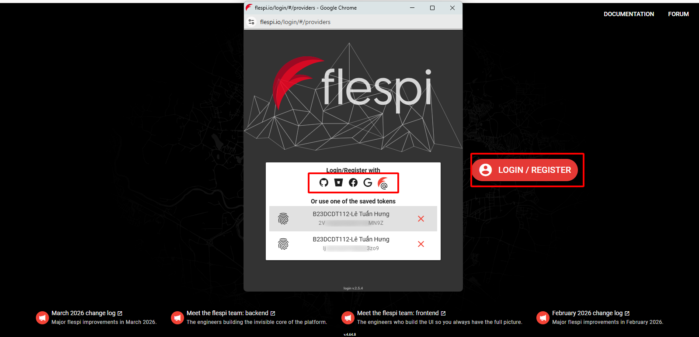
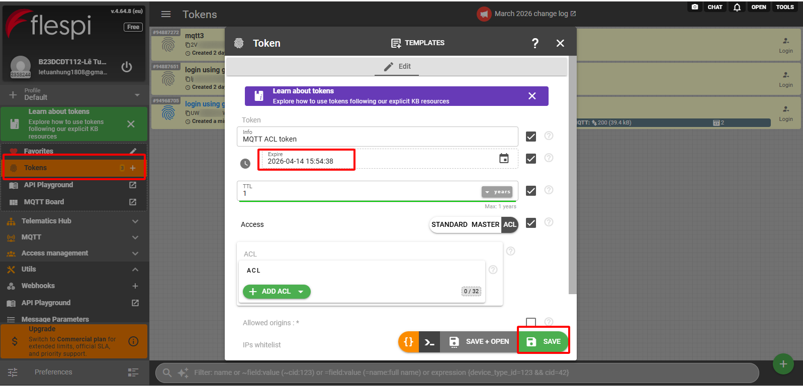

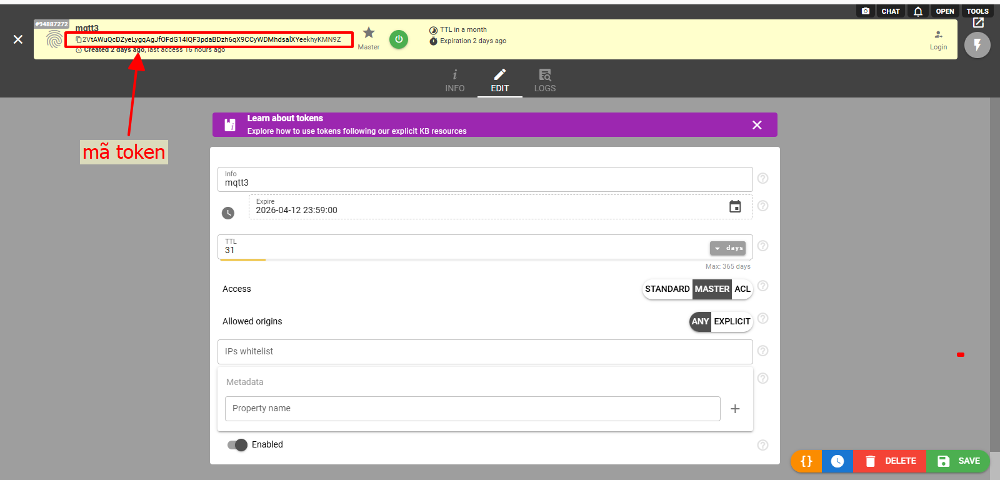
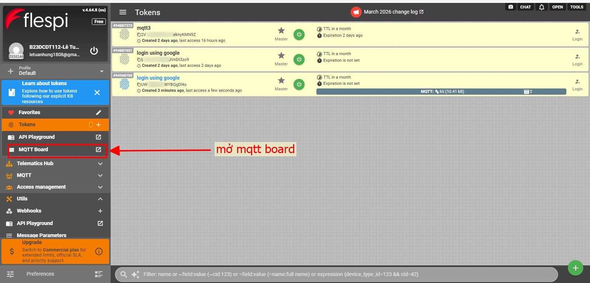
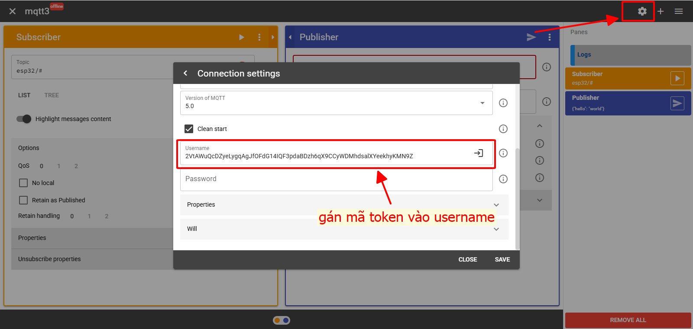
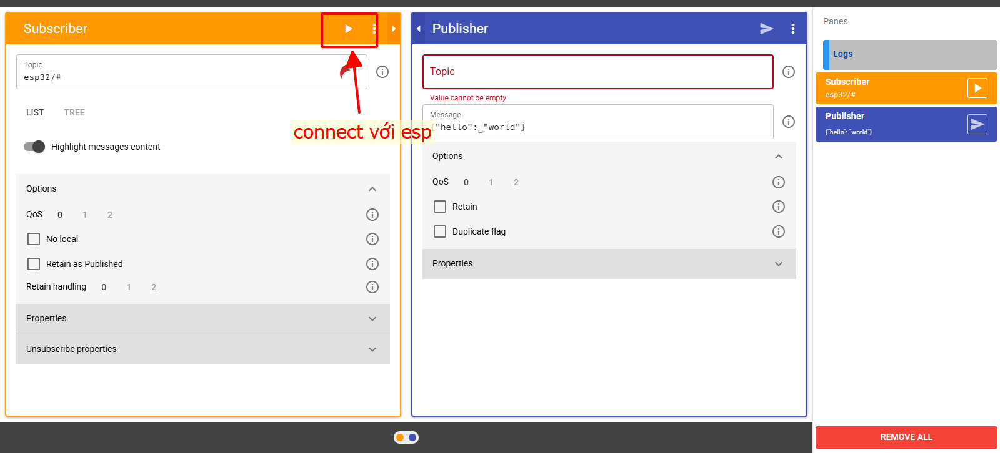


## 4. Cấu hình dữ liệu cho file ini

Up thêm 2 file ini lên flash :

- WIFI.ini :
```
[WIFI1]
ssid=MessiNguyen
password=22102005
[WIFI2]
ssid=Xuong
password=68686868
[WIFI2]
ssid=TuanDung
password=0913583737
```

- config.ini :
```
[HIVEMQ]
hive_server=449b784be10a4cc9b33005afc8231712.s1.eu.hivemq.cloud
hive_user=ESP32_MQTT
hive_pass=Abc@1234
[EMQX]
emqx_server=d816ff63.ala.asia-southeast1.emqxsl.com
emqx_user=esp32
emqx_pass=22102005
[FLESPI]
flespi_server=mqtt.flespi.io
flespi_token=2VtAWuQcDZyeLygqAgJfOFdG14IQF3pdaBDzh6qX9CCyWDMhdsalXYeekhyKMN9Z
```

## 5. Thêm 1 vùng LittleFS với 64Kb

File partition.csv được phân vùng với 64kb cho littlefs như sau :
```
# Name,     Type, SubType, Offset,   Size
nvs,        data, nvs,     0x9000,   0x5000
otadata,    data, ota,     0xE000,   0x2000
app0,       app,  ota_0,   0x10000,  0x140000
app1,       app,  ota_1,   0x150000, 0x140000
spiffs,     data, spiffs,  0x290000, 0x160000
littlefs,   data, spiffs,  0x3F0000, 0x10000
```
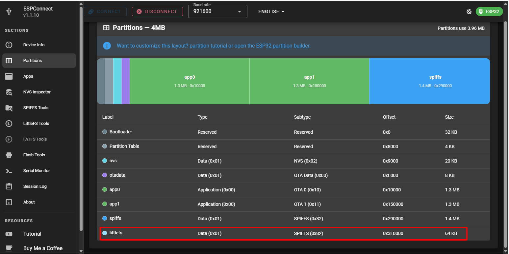


## 6. Kết nối và gửi dữ liệu lên MQTT
Kết nối và gửi dữ liệu lên 3 MQTT broker với code chính sau : [main.c](src/maincode/main.cpp)


*Giải thích code :
1. Sơ đồ hoạt động
```
BOOT ESP32
   ↓
Mount LittleFS
   ↓
Đọc danh sách WiFi (wifi.ini)
   ↓
Auto connect WiFi
   ↓
Đọc MQTT config (config.ini)
   ↓
Setup MQTT TLS
   ↓
Loop:
   - reconnect MQTT
   - đọc DHT
   - publish dữ liệu
```
2. Thư viện đang dùng
```c
WiFi.h              → kết nối mạng
WiFiClientSecure.h  → TLS / SSL
PubSubClient.h      → MQTT client
DHT.h               → cảm biến DHT11
LittleFS.h          → filesystem flash
IniFile.h           → đọc file .ini
```

3. FILESYSTEM — LittleFS
```c
initFS()
LittleFS.begin(true)
```

mount flash partition
nếu lỗi → tự format

Sau bước này:
```
/wifi.ini
/config.ini
```

mới đọc được.

4. Dò và kết nối wifi
```c
autoConnectWiFi()
```

Đọc wifi từ :
```
/wifi.ini
```
Logic hoạt động

- Biến:
```c
int n = 1;
```

ESP thử:
```
WIFI1
WIFI2
WIFI3
```

- Bước 1 — tạo section
```c
sprintf(section,"WIFI%d",n);
```
Ví dụ: ```WIFI1, WIFI2```

- Bước 2 — đọc SSID
```c
getIniValue("/wifi.ini","WIFI1","ssid",...)
```

Nếu không tồn tại: ```Restart WiFi list...```

→ quay lại WIFI1.

- Bước 3 — thử connect
```c
WiFi.begin(ssid,pass);
```

ESP chờ 1 giây:
```c
while(millis()-t < 1000)
```

Nếu connect thành công: ```CONNECTED!```

→ thoát hàm.

- Bước 4 — thất bại
```
Fail → next WiFi
disconnect
thử WiFi tiếp theo
```

5. DHT11 Sensor
```c
#define DHTPIN 4
```
GPIO4 đọc cảm biến.
```c
readDHT()
```

Đọc:
```
humidity
temperature
```


6. MQTT CONFIG SYSTEM

Các biến:
```c
hive_server
emqx_server
flespi_server
```

Được load từ:
```c
/config.ini
loadConfig()
```
Gọi:
```c
getIniValue()
```
để đọc:
```
[HIVEMQ]
[EMQX]
[FLESPI]
```


7. MQTT Setup
```c
mqttHive.setServer(hive_server,8883);
```
8883 = MQTT over TLS.

8. MQTT Reconnect System

Trong loop:
```c
connectHive();
connectEmqx();
connectFlespi();
```
Nếu mất mạng --> ESP tự reconnect.


9. LOOP

Loop chạy liên tục:

(1) giữ MQTT alive
```c
mqtt.loop();
```
Nếu thiếu dòng này:

MQTT sẽ tự disconnect.

(2) đọc DHT mỗi 2 giây
```c
if(millis()-lastRead>2000)
```


(3) Publish MQTT

Mỗi 2.5s:
```
{
 "temp":30.2,
 "humi":70.1
}
```
Gửi tới 3 broker cùng lúc:
```
HiveMQ
EMQX
Flespi
```

10. Setup Flow
```c
setup()
```
chạy một lần:
```
Serial start
↓
DHT begin
↓
Mount LittleFS
↓
Auto WiFi connect
↓
Load MQTT config
↓
Setup MQTT
```

*Kết quả thực nghiệm :

sertial :
```
LittleFS READY
Connecting -> MessiNguyen
Fail → next WiFi
Connecting -> Xuong
Fail → next WiFi
Connecting -> TuanDung

WiFi CONNECTED
Loading config.ini
CONFIG LOADED
{"temp":30.80,"humi":77.00}
{"temp":30.20,"humi":76.00}
{"temp":30.20,"humi":77.00}
....
```


>Kết luận :
- Dữ liệu không bị lỗi
- Hiển thị đều nhau giữa 3 MQTT


## 7. Cấu hình nhiều wifi

- Thông tin wifi em sẽ lưu vào file ```wifi.ini``` và sẽ được đọc ra bằng thư viện và kết nối
```
[WIFI1]
ssid=MessiNguyen
password=22102005
[WIFI2]
ssid=Xuong
password=68686868
[WIFI3]
ssid=TuanDung
password=0913583737
```
- Hàm lấy wifi là 2 hàm trong [main.c](src/maincode/main.cpp) :
```c
initWiFiDriver();  
autoConnectWiFi();
```
*Giải thích code :

1. Khai báo buffer
```c
char ssid[32];
char pass[32];
char section[16];
```
Dùng để chứa dữ liệu đọc từ file INI:
```
ssid → tên WiFi
pass → mật khẩu
section → tên section [WIFI1]
```

2. Bắt đầu từ WIFI1
```c
int n = 1;
```

ESP sẽ đọc:
```
WIFI1
WIFI2
WIFI3
...
```
3. Loop cho tới khi connect được
```c
while(WiFi.status()!=WL_CONNECTED)
```
Nếu chưa có mạng → thử tiếp.

4. Tạo tên section
```c
sprintf(section,"WIFI%d",n);
```

Ví dụ:
```
n=1 → WIFI1
n=2 → WIFI2
```

5. Đọc SSID từ file ini
```c
getIniValue(WIFI_FILE, section, "ssid", ssid, sizeof(ssid))
```
Thực chất đang đọc:
```
[WIFI1]
ssid=Xuong
```
Nếu không tồn tại:
```
n = 1;
continue;
```
→ quay lại đầu danh sách.


6. Đọc password
```c
getIniValue(...,"password",pass,...);
```
Lấy mật khẩu tương ứng.

7. Bắt đầu connect
```c
WiFi.begin(ssid,pass);
```
ESP bắt đầu handshake WiFi.

8. Chờ tối đa 8 giây
```c
unsigned long t = millis();
while(millis()-t < 8000)
```


9. Nếu connect thành công
```c
if(WiFi.status()==WL_CONNECTED)
```
In: ```WiFi CONNECTED```

10. Nếu connect thất bại
```c
WiFi.disconnect();
delay(800);
n++;
```
ngắt WiFi hiện tại
chuyển sang WiFi tiếp theo


+ Flow tổng thể :
```
Start
  ↓
Read WIFI1
  ↓
Try connect
  ↓
Success ? ---- YES → DONE
  |
  NO
  ↓
Read WIFI2
  ↓
Fail hết ?
  ↓
Quay lại WIFI1
```
>Kết luận : Khi có nhiều wifi thì phải kết nối từ trên xuống --> làm mất rất nhiều thời gian

>Cách giải quyết : Sau khi kết nối với mỗi wifi, ta sẽ có 1 biến đếm để lưu só lần kết nối với wifi đó. Lần sau kết nối ta sẽ ưu tiên wifi nào có số lần kết nối nhiều nhất đến ít nhất.


# C. Khó khăn đang gặp

- Chưa có phương án giải quyết vấn để up file chậm
- Chưa có cách để dò wifi nhanh và không cần dò từ trên xuống

# D. Công việc tiếp theo


# F. Linh kiện đang giữ
|Tên|Số lượng|
|---|---|
|Không |Không |
| | |
| | |
| | |