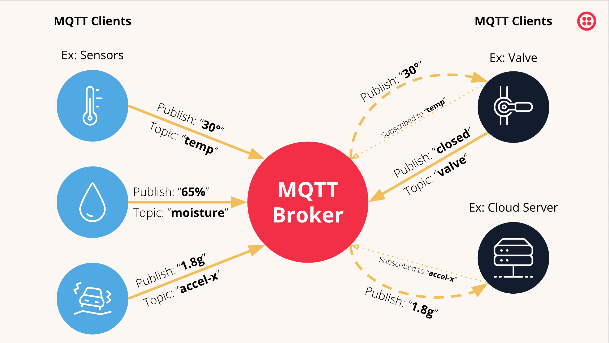
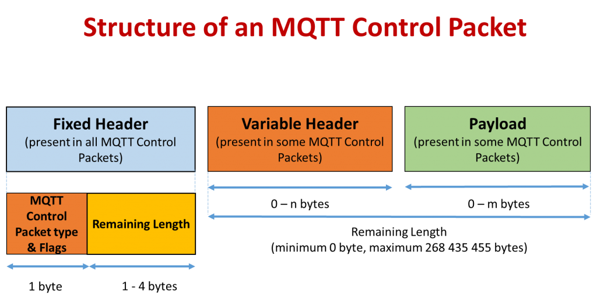
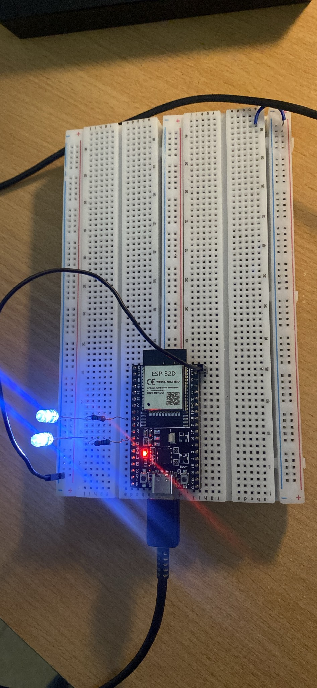
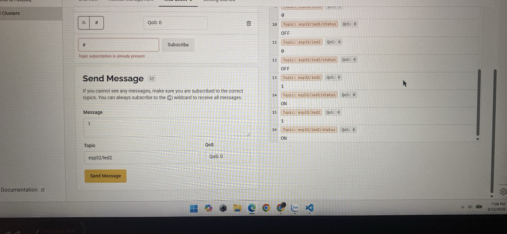

# D23_LE_TUAN_HUNG
***báo cáo công việc ngày 14/3/26***
# A. Công việc đã làm
1. Tìm hiểu khái niệm cơ bản về giao thức MQTT
2. Set up một project đơn giản ESP32 kết hợp MQTT
3. Tìm hiểu sâu về các phần bên trong

# B. Công việc chi tiết


## 1. Tìm hiểu về giao thức MQTT
### 1.1. MQTT là gì 
MQTT (Message Queuing Telemetry Transport) là giao thức truyền dữ liệu theo mô hình publish/subscribe dùng để trao đổi dữ liệu giữa các thiết bị qua mạng TCP/IP
### 1.2. Cấu tạo hệ thống của MQTT
#### 1.2.1. Broker là trung tâm của hệ thống MQTT

Nhiệm vụ của broker: 
* nhận dữ liệu từ publisher
* kiểm tra topic
* gửi dữ liệu đến subscriber phù hợp
* quản lý kết nối client
* quản lý QoS

Một số broker phổ biến:
* Mosquitto MQTT Broker
* HiveMQ
* EMQX
#### 1.2.2. Client là thiết bị kết nối với broker
Client có thể là:
* publisher: Thiết bị gửi dữ liệu
* subscriber: Thiết bị nhận dữ liệu
* hoặc cả hai

Ví dụ client:
* ESP32
* cảm biến
* ứng dụng điện thoại
* máy tính

#### 1.2.3. Topic là đường dẫn logic để phân loại dữ liệu
+ Broker dựa vào topic để biết gửi dữ liệu cho ai

Ví dụ:
```
home/temperature
home/light1
home/light2
factory/motor/status
```
### 1.3. Cách hoạt động của MQTT
*Quy trình hoạt động:

* Bước 1:
    Client kết nối broker
~~~
Client ---- CONNECT ----> Broker
~~~
* Bước 2:
    Subscriber đăng ký topic
~~~
SUBSCRIBE home/temp
~~~
* Bước 3:
    Publisher gửi dữ liệu
~~~
PUBLISH home/temp = 30
~~~
+ Bước 4:
    Broker gửi dữ liệu cho subscriber
~~~
Broker ----> Subscriber
~~~
<p align="center">
  
  <br>
  <em>mô hình hoạt động của MQTT</em>
</p>

### 1.4. Cấu trúc gói tin của MQTT
Một số MQTT packet có 3 thành phàn trính
~~~
MQTT Packet
│
├── Fixed Header
│     ├── Packet Type
│     ├── Flags
│     └── Remaining Length
│
├── Variable Header
│     ├── Topic
│     ├── Packet ID
│     └── Protocol info
│
└── Payload
      └── Data
~~~
#### a. Fixed Header
* Là phần bắt buộc trong mọi gói MQTT.

* Chứa:

     * Packet Type: xác định loại gói tin (CONNECT, PUBLISH, SUBSCRIBE,…).

     * Flags: các bit điều khiển (QoS, DUP, RETAIN…).

     * Remaining Length: độ dài phần dữ liệu còn lại của gói tin.

* Mục đích: Giúp thiết bị nhận biết loại gói tin và kích thước dữ liệu cần đọc.

#### b. Variable Header 
+ Chứa thông tin phụ thuộc vào loại packet.

+ Mục đích: Cung cấp thông tin chi tiết để broker xử lý gói tin.
#### c. Payload
+ Là phần dữ liệu thực sự được truyền.

+ Ví dụ:

     + dữ liệu cảm biến

     + trạng thái thiết bị

+ Mục đích: Chứa nội dung dữ liệu mà thiết bị muốn gửi hoặc nhận.

<p align="center">
  
  <br>
  <em>cấu trúc gói tin</em>
</p>


## 2. Set up 1 project đơn giản ESP32 kết hợp MQTT
### 2.1. Mạch mô phỏng đơn giản


*Sử dụng 2 chân 14 và chân 25 để điều khiên led* 

### 2.2. Broker và code
* Em sử dụng [HiveMQ](https://www.hivemq.com/products/mqtt-cloud-broker/) làm broker
* Dùng Visual code để lập trình cho ESP32

### 2.3. Quá trình set up
* Vào HiveMQ để tạo server(url,port,usename,pass,...)
* Sau đó code cho ESP32 : [Code](src/project_esp32_mqtt/main.cpp)
* Các bước hoạt động chính :
   * Kết nối wifi :
   ```c
   //const char* ssid = "TuanDung";
   //const char* password = "0913583737";
   WiFi.begin(ssid, password);
   ```
   * Mở server broker :
   ```c
   //const char* mqtt_server = "449b784be10a4cc9b33005afc8231712.s1 eu.hivemq.cloud";
   //const int mqtt_port = 8883;
   client.setServer(mqtt_server, mqtt_port);
   ```
   * Kết nối Broker của HiveMQ :
   ```c
   //const char* mqtt_user = "ESP32_MQTT";
   //const char* mqtt_pass = "Abc@1234";
   client.connect("ESP32Client", mqtt_user, mqtt_pass)
   ```
   * Tạo MQTT client :
   ~~~c
   WiFiClientSecure espClient;
   PubSubClient client(espClient);
   ~~~
   * Đăng kí topic :
   ~~~c
   client.subscribe("esp32/led1");
   client.subscribe("esp32/led2");
   ~~~
   * Đăng kí hàm callback :
   ~~~c
   client.setCallback(callback);
   ~~~
   --> Khi có message từ broker thì gọi làm callback để điều khiển led
   * Xử lí message MQTT :
   ~~~c
   client.loop();
   ~~~
   --> Kiểm tra message mới
  
* Luồng dữ liệu hệ thông :

.png>)
## 2.4. Kết quả thức nghiệm 
Điều khiển bật 2 led :
<p align="center">
  
  
</p>

Giá trị hiển thị lên web client :



## 3. Tìm hiểu sâu về các phần bên trong

### 3.1. Phía các subscriber
-Web client chính là subscriber khi nhận dữ liệu mà ESP32 thu được từ con cảm biến

-Trong các dự án thì ESP32 cũng chính là 1 subscriber.

-ESP32 nhận dữ liệu khi máy tính publish 1 lệnh :
~~~
Topic: esp32/led1
Message: 1
~~~
--> ESP32 bật led1

.png>)

> Kết luận : Nơi nào có nhận dữ liệu thì là subscriber

### 3.2. Phía publisher
-Publisher trong các dự án có thể là :
- Máy tính : gửi lệnh đến ESP32(subscriber)
- ESP32 : gửi dữ liệu thu dược từ cảm biến đến máy tính

-Publisher muốn publish 1 tín hiệu gì đấy thì phải có địa chỉ topic thì mới publish được

-Ví dụ :

.png>)

### 3.3. Hoạt động của ESP32
#### a. Esp32 kết nối với wifi
```python
WiFi.begin(ssid, password);
```
- Esp32 quét tất của các mạng xung quanh để tìm SSDI
- Tìm đến mạng có tên wifi mình nhập
- Xác thực mật khẩu, so sánh password với router
- Qua đó router cấp IP cho Esp32
```
ESP32 → kết nối router → có IP → sẵn sàng lên Internet
```

#### b. ESP32 kết nối với Broker MQTT
```c
client.setServer(mqtt_server, mqtt_port);
client.connect("ESP32Client", mqtt_user, mqtt_pass);
```
- Esp32 tìm IP broker (mã url))
- Mở kết nối TCP (port 8883)
- Thiết lập bào mật
- Gửi gói connect MQTT
- Broker phản hồi kết nối thành công hoặc chưa thành công

#### c. Esp32 đăng kí Subscriber và nhận lệnh từ Publisher

#### d. Esp32 gửi dữ liệu đi

# C. Khó khăn đang gặp
Chưa hiểu rõ được hoạt động của Esp32 
# D. Công việc tiếp theo

Tiếp tục tìm hiểu sâu hơn về giap thức
# F. Linh kiện đang giữ
|Tên|Số lượng|
|---|---|
|Không |Không |
| | |
| | |
| | |