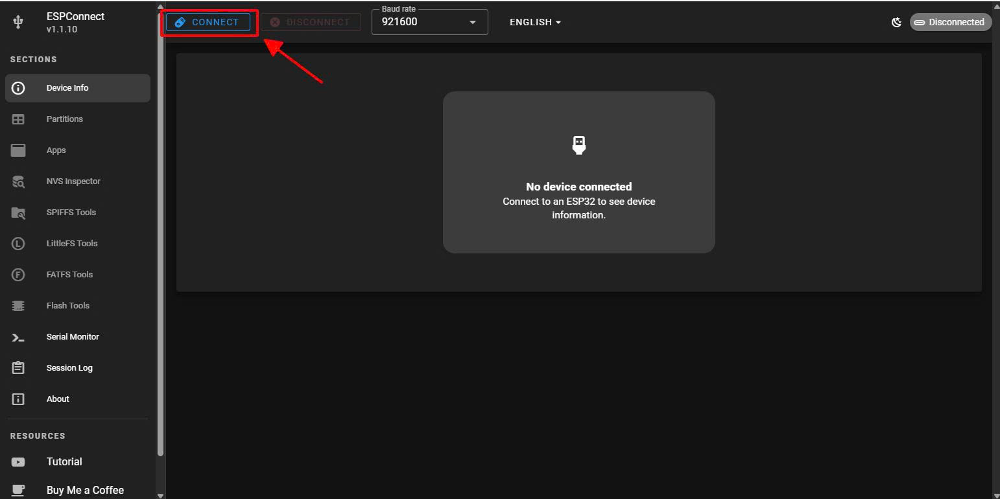
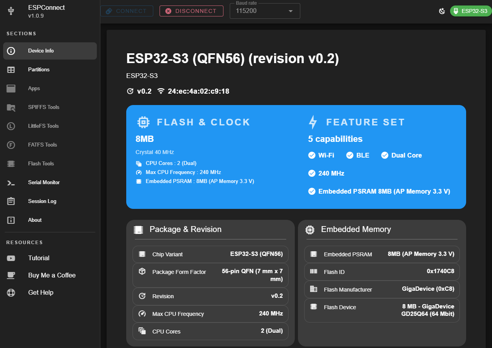
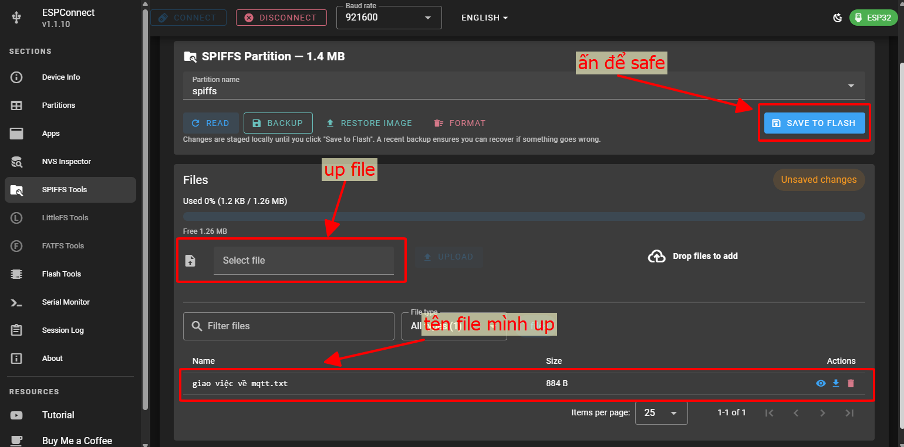
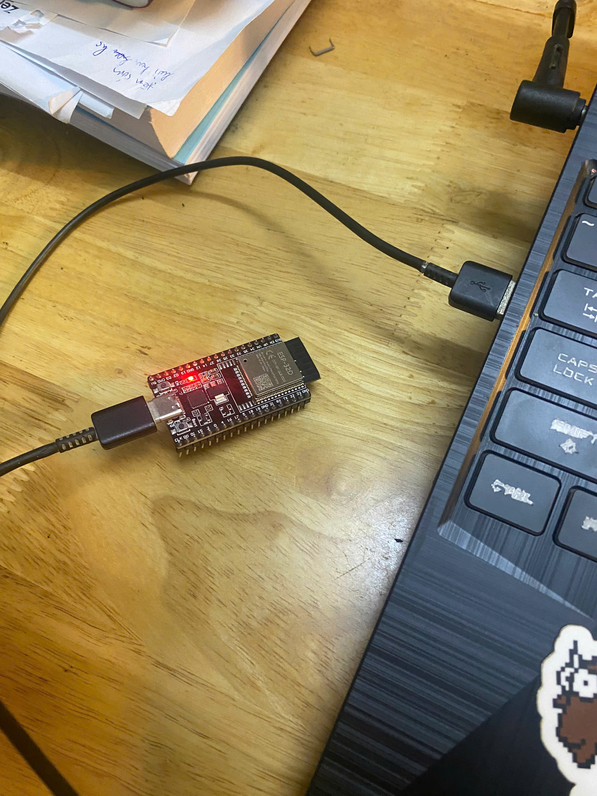
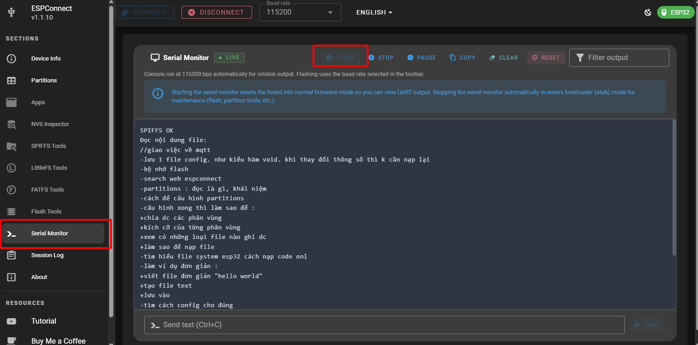

# D23_LE_TUAN_HUNG
***báo cáo công việc ngày 21/3/26***
# A. Công việc đã làm
1. Tìm hiểu qua về Esoconnect
2. Công việc đã làm được

# B. Công việc chi tiết
## 1. Tìm hiểu qua về Espconnect
### a. Khái niệm
ESPConnect là một công cụ web để làm việc trực tiếp với ESP qua USB, chạy trực tiếp trên trình duyệt :   [Web](https://thelastoutpostworkshop.github.io/ESPConnect/)
```
kết nối – kiểm tra – nạp firmware – quản lý ESP32/ESP8266 qua USB
```
|               | ESPconnect   |
|---------------|-------------------|
|  Kết nối      |      USB             |
|    Mục đích   |      debug, flash    |
|   Giao diện   |      web local       |
|  Internet     |      Không cần       |


-  Cấu tạo ESPConnect web thường chia thành:
     1. Device Info
        - Đọc thông tin chip
        - Flash size
        - MAC address
   2. Flash Tool
        - Nạp firmware .bin
        - Xóa flash
   3. File Manager
        - Quản lý file trong flash
        - Upload web, config, data
   4. Serial Monitor
        - Xem log
        - Debug code
   5. Backup / Restore
        - Sao lưu firmware
        - Khôi phục
### b. Device info

Giúp bạn trả lời các câu hỏi như :
 - Đây có đúng ESP32 không?
  - Flash bao nhiêu MB?
  - Chip loại gì?
  - Có lỗi phần cứng không?

Khi bạn bấm Connect:

- Trình duyệt dùng Web Serial
- Gửi lệnh xuống ESP
- ESP trả về thông tin từ ROM/bootloader

→ ESPConnect chỉ đọc, không sửa gì

<p align="center">
  
  
</p>


### c. Partition
Partition (phân vùng) = cách chia bộ nhớ flash của ESP thành các vùng nhỏ, mỗi vùng có nhiệm vụ riêng.

Ví dụ :
```
Flash (4MB)
│
├── Bootloader
├── Partition Table
├── Firmware (App)
├── OTA (firmware dự phòng)
├── File System (SPIFFS / LittleFS)
└── NVS (lưu config)
```
](<images/Screenshot 2026-03-24 211942.png>)
*phân vùng partition như trên*

1. NVS – bộ nhớ cấu hình (rất hay dùng)

- Tác dụng : Lưu dữ liệu không mất khi tắt nguồn


2. OTADATA – vùng điều khiển OTA

- Tác dụng : Ghi trạng thái firmware đang chạy


3. APP0 – firmware chính

- Tác dụng : Chứa code bạn upload


4. APP1 – firmware dự phòng (OTA)

Tác dụng : Dùng cho OTA
```
Đang chạy app0 → tải firmware mới → ghi vào app1 → reboot → chuyển sang app1
```


5. SPIFFS – vùng lưu file
- Tác dụng : Lưu file


### d. File system(SPIFFS)
ESP32 sử dụng các file system như SPIFFS, LittleFS và NVS để quản lý dữ liệu trên bộ nhớ Flash, cho phép lưu trữ, đọc, ghi và xóa file một cách hiệu quả

SPIFFS (Serial Peripheral Interface Flash File System) :

- Cho phép read, write, close, delete file, nhưng không hỗ trợ thư mục. 

- Cho phép upload file từ máy tính vào ESP32 thông qua plugin ESP32 Filesystem Uploader, giúp quản lý dữ liệu dễ dàng hơn so với nhúng trực tiếp vào code. 

- Ngoài ra, ESP32 hỗ trợ OTA Update, cho phép cập nhật firmware từ xa mà không cần kết nối vật lý, tận dụng file system để lưu trữ dữ liệu tạm thời hoặc cấu hình người dùng. 

*Lập trình trên Esp : [Code](src/main.cpp)

-Em sử dụng Vscode để thao tác với file trên Esp32 : Main
```c
#include "SPIFFS.h"
``` 
- Thư viện làm việc với file system spiffs trong flash

```c
Serial.begin(115200);
```
- Mở serial để in ra máy tính

```c
  if (!SPIFFS.begin(false)) {
    Serial.println("SPIFFS Mount Failed!");
    return;
  }
```
- Kết nối, kích hoạt file system. Nếu không mout được thì in ra "SPIFFS Mount Failed"
```c
  File file = SPIFFS.open("/giao việc về mqtt.txt");
```
- Mở file 'giao việc về mqtt.txt' trong flash. Dấu '/' nghĩa là root của filesystem

```c
  while (file.available()) {
    Serial.write(file.read());
  }
```
- Đọc từng byte(kí tự) trong file rồi in ra serial


-Trong platformio.ini :
~~~c
board_build.partitions = default.csv
~~~
- dùng file.csv có sẵn
```
# Name, Type, SubType, Offset, Size
nvs,      data, nvs,     0x9000,  0x5000
otadata,  data, ota,     0xE000,  0x2000
app0,     app,  ota_0,   0x10000, 0x140000
app1,     app,  ota_1,   ,        0x140000
spiffs,   data, spiffs,  ,        0x170000
```

- Sau khi upload code Vscode tạo file.bin --> phân vùng partition

*Trong Espconnect có SPIFFS tools :
- Up file trong này



## 2. Công việc đã làm được

1. Nạp [Code](src/main.cpp) cho Esp bằng Vscode


2. Kết nối esp với máy tình



3. Vào trang [web](https://thelastoutpostworkshop.github.io/ESPConnect/), ấn connect


- Sau khi kết nối thành công, mục Device info sẽ hiện thông tin Esp


4. Up file.txt lên SPIFFS tools


5. Đọc file .txt đã up trong flash của Esp



# C. Khó khăn đang gặp


# D. Công việc tiếp theo
Tiếp tục tìm hiểu các úng dụng khác của espconnect


# F. Linh kiện đang giữ
|Tên|Số lượng|
|---|---|
|Không |Không |
| | |
| | |
| | |