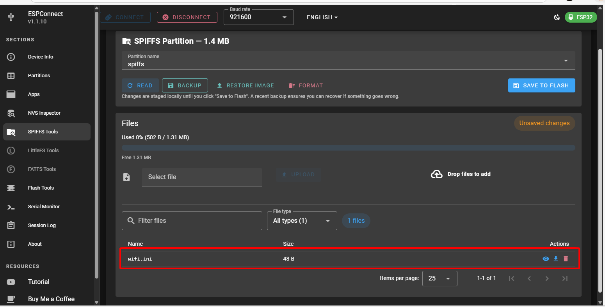

# D23_LE_TUAN_HUNG
***báo cáo công việc ngày 28/3/26***
# A. Công việc đã làm
1. Custom paritiom
2. Tạo file ini và sử dụng
# B. Công việc chi tiết
## 1. Custom partition
-Tạo 1 file csv trong folder chứa main code

-Dựa vào khung phân vùng rồi chúng ta thay đổi theo yêu cầu :

| Name  |Type | SubType |Offset|  Size  |Flag|
|-------|-----|--------|------|---------|----|
|NVS|  data   |  nvs      |         |       |
|otadata|data    |  ota    |      |         |
|app0| app    |  ota_0   |      |         |
|app1 | app    |  ota_1   |      |         |
|spiffs|  data |  spiffs   |      |         |
|.....| ......  | ......   |      |         |

- Offset và size là do chúng ta xác định và tính toán
- Tuy nhiên địa chỉ bắt đầu bắt buốc phải từ 0x8000
- Cách ghi offset theo size :
  - Ta có thể để trống để công cụ ```gen_esp32part.py``` sẽ tự động tính Offset bằng cách lấy (Offset trước + Size trước). Nó cũng tự động làm tròn (align) để đảm bảo phân vùng App bắt đầu đúng vị trí 64KB.
- Ta cũng có thể chọn địa chỉ offset mà mình muốn để bằng mã HEX

> Tổng size của các vùng không được quá đung lượng flash của Esp(thường là 4Mb)

> Nếu tự ghi offset thì offset dưới không được nhỏ hơn tổng của offset trên cộng với size trên

## 2. Tạo file ini và sử dụng
*Khái niệm :
- File ini là file văn bản dùng để lưu cấu hình chương trình dưới dạng key–value có cấu trúc.

- Mục đích chính :
   - tách configuration khỏi source code
   - thay đổi cấu hình không cần biên dịch lại

- Cấu tạo :
   - Nhóm : ```[SectionName] ```
   - Key-value sang : ```key = value ```

ví dụ :
```c
[WIFI]
ssid = Xuong
password = 68686868
```

```
INI FILE
 ├── Section
 │     ├── key=value
 │     └── key=value
 └── Section
       └── key=value
```

*Test thử :

B1 : Tạo file.ini với nội dung :
```Python
[WIFI]
ssid = Xuong
password = 68686868
```

B2 : Up file.ini lên flash của Esp


B3 : Code gọi file.ini trong flash và serial giá trị : [Code](src/main.cpp)

- Vào terminal xen nội dung trong file.ini :
```
E (147) esp_core_dump_flash: No core dff␋�partition found!
E (147) esp_core_dump_flash: No core dump partition found!
SPIFFS OK
Reading wifi.ini ...
SSID: Xuong
PASSWORD: 68686868
```

B4 : thay đổi value trong file.ini thành :
```c
[WIFI]
ssid = MessiNguyen
password = 22102005
```

B5 : Up lại file.ini lên flash 


B6 : Vào terminal xem giá trị mới vừa được thay đổi :
```
E (147) esp_core_dump_flash: No core dff␋�partition found!
E (147) esp_core_dump_flash: No core dump partition found!
SPIFFS OK
Reading wifi.ini ...
SSID: MessiNguyen
PASSWORD: 22102005
```

*giải thích code : 
1. Biến toàn cục :
```py
String ssid;
String password;
```
- Dùng để lưu:
    - ssid đọc từ wifi.ini
    - password đọc từ wifi.ini

2. Hàm ```InitFS()``` :
```c
void initFS()
{
    if(!SPIFFS.begin(true))
```
--> Esp thực hiện mount file system


3. hàm ``` readConfig()``` :
```c 
File file = SPIFFS.open("/wifi.ini");
```
--> ESP32 tìm file trong flash: ```/wifi.ini```

```c
String line = file.readStringUntil('\n');
line.trim(); 
```
--> Đọc từng dòng của file và bỏ khoảng trắng

```c
if(line.startsWith("ssid"))
{
   ssid = line.substring(line.indexOf("=")+1);
   ssid.trim();
}

if(line.startsWith("password"))
{
   password = line.substring(line.indexOf("=")+1);
   password.trim();
}
}
```

```c
if(line.startsWith("ssid"))
```
--> Tìm đến dòng có bắt đầu bằng "ssid"
```c
ssid = line.substring(line.indexOf("=")+1);
ssid.trim();
```
--> Gán ssid bằng chuỗi kí tự sau dấu "=" sau đó bỏ khoảng trắng

4. Hàm ```void setup()```

```c
initFS();
readConfig();
```
- Gọi hàm mount spiffs và đọc file

```c
    Serial.print("SSID: ");
    Serial.println(ssid);

    Serial.print("PASSWORD: ");
    Serial.println(password);
```
- In ssid và password ra màn hình

*Luồng hoạt động :
```
ESP32 RESET
     ↓
setup()
     ↓
Mount SPIFFS
     ↓
Open wifi.ini
     ↓
Parse text
     ↓
Lấy SSID/PASS
     ↓
In Serial
```


# C. Khó khăn đang gặp


# D. Công việc tiếp theo


# F. Linh kiện đang giữ
|Tên|Số lượng|
|---|---|
|Không |Không |
| | |
| | |
| | |